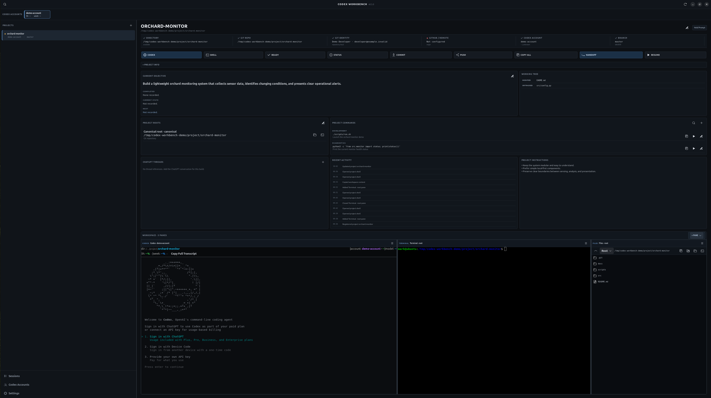

# Codex Workbench v0.5.0

Codex Workbench is a native Linux project workspace for projects that span multiple
Codex accounts, Git/GitHub identities, ChatGPT threads, directories, Work
Sessions, terminals, previews, and files.

The core rule is: **select the project once; every downstream action inherits
its context.** Workbench orchestrates the existing `codex-start` launcher; it
does not replace or reimplement it. The service/CLI core remains Python
standard-library only. The native interface uses GTK4 and libadwaita.

## Workbench



## Implemented now

- compact dark GTK4/libadwaita project workbench with asynchronous integration reads;
- responsive, collapsible Project Info grid with per-project collapsed state;
- one-shot, text-only Prompt Hold per project, independent of clipboard history;
- persistent Project Commands with manual editing, copy, visible-terminal execution,
  and read-only suggestions from package.json, Makefile, justfile, pyproject.toml,
  Cargo.toml, and Docker Compose files;
- project-owned recursive split layouts with draggable horizontal/vertical boundaries;
- live Codex, Terminal, Browser, and Files pane providers behind a modular registry;
- embedded `codex-start` VTE sessions with account/session deduplication and an
  explicit New Codex Pane action;
- multiple persistent project terminals, dock/undock windows, pane movement, and
  Focus mode without a second layout model;
- lightweight Files navigation across canonical/associated roots, copy/open/reveal,
  and Shell Here;
- optional WebKitGTK browser with minimal navigation and external-browser fallback;
- safe project edit/removal, labeled associated paths, guarded commit/push,
  handoff/resume, account intent, activity, and the complete existing CLI;
- versioned schema-4 project persistence with v0.4 migration and runtime-only PTYs.

Workbench uses `codex-start` from `PATH` first. The launcher under
`integrations/codex-launcher/` remains a development fallback.

## Install and run on Ubuntu

Install the native bindings, VTE, and preferred external terminal from Ubuntu packages:

```bash
sudo apt install python3-venv python3-gi gir1.2-gtk-4.0 gir1.2-adw-1 gir1.2-vte-3.91 tilix
# Optional embedded Browser panes:
sudo apt install gir1.2-webkit-6.0
```

The native GUI uses the GTK/GDK clipboard directly. Optional `xclip`, `xsel`,
or `wl-clipboard` helpers are used only by CLI clipboard commands when present.
If GTK4 VTE introspection is absent, Workbench disables Terminal/Codex panes,
explains why, and retains external terminal launch. If WebKitGTK or its process
sandbox is unavailable, only Browser panes are disabled; startup remains safe.

Run directly from the repository without a global project install:

```bash
python3 -m codex_workbench gui
```

For editable development and the short commands, let the virtual environment
see Ubuntu's system PyGObject packages:

```bash
cd codex-workbench
python3 -m venv --system-site-packages .venv
source .venv/bin/activate
python3 -m pip install -e .
cwb gui
# Equivalent native entry point:
codex-workbench
```

The full CLI remains available:

```bash
cwb --help
python3 -m codex_workbench --help
```

Verify GUI dependencies/resources without an X11 or Wayland server:

```bash
cwb gui --check
```

## Pin it to the Ubuntu dock

After the editable install, create an explicit per-user application launcher:

```bash
cwb install-desktop
```

Open Ubuntu's application grid, launch **Codex Workbench**, then choose
**Add to Favorites**. The installer writes only the user desktop entry and
scalable icon under `~/.local/share`; it does not modify projects.

## First run

With no projects, the window presents one focused **Add Project** action. Choose:

- **Existing local project**: project name and directory; or
- **Clone Git repository**: name, URL, destination parent, and editable folder;
- optionally a preferred Codex account and GitHub expectation.

Clone validates and previews the destination, refuses non-empty conflicts, and
registers only after Git succeeds. Workbench then detects the repository,
branch, remote, worktree, and effective Git identity.
Selecting a project row refreshes its context immediately; there is no Load
button.

## Daily workflow

The fastest path is deliberately short:

```text
Workbench open → select project-alpha → click CODEX → keep working in its restored workspace
```

That launch inherits the intended directory, Codex account, Git/GitHub context,
and current Work Session. The same workspace exposes compact actions for
SHELL, READY, STATUS, COMMIT, PUSH, COPY ALL, HANDOFF, and RESUME.

The upper account strip is selection-only. Clicking an account updates project
or active-session intent and never silently launches Codex or creates a
handoff.

## Interface map

```text
┌ Codex accounts · 5h/week usage · reset details ─────────────────────┐
├ Projects / Sessions / Settings ┬ Project · Edit · Prompt Hold        │
│ project-alpha                  │ Context confidence · actions         │
│ project-beta                   │ ▾ PROJECT INFO                       │
│ sample-repo                    │ responsive objective/tree/roots/     │
│                                │ commands/threads/activity/instructions│
│                                ├ WORKSPACE · + PANE ─────────────────┤
│                                │ Codex │ Terminal                     │
│                                │───────┼ Browser / Files              │
└────────────────────────────────┴─────────────────────────────────────┘
```

Valid checks stay visually quiet. Warnings and mismatches carry the visual
weight, especially before commit and push. Paths, branches, hashes, and account
statistics use monospace typography; labels and actions use the native UI font.

## Keyboard shortcuts

| Shortcut | Action |
|---|---|
| `Ctrl+K` | Command palette and project switch |
| `Ctrl+Enter` | Open Codex |
| `Ctrl+Shift+Enter` | Open project shell |
| `Ctrl+Shift+C` | Copy all context |
| `Ctrl+Shift+H` | Handoff |
| `Ctrl+Shift+R` | Ready / preflight |

Shortcuts also appear in tooltips and the command palette.

## Screenshots

Screenshot placeholder for the tagged v0.5.0 release:

```text
docs/screenshots/v0.5.0-project-workspace.png
```

The current interface is the compact three-level layout shown above: account
strip, narrow project rail, and dense workspace with an optional warning/
activity surface. The application is functional without a screenshot asset.

## Local data

Workbench does not put session state in the project repository.

```text
$XDG_CONFIG_HOME/codex-workbench/projects.json
$XDG_CONFIG_HOME/codex-workbench/settings.json
$XDG_DATA_HOME/codex-workbench/activity.json
$XDG_DATA_HOME/codex-workbench/sessions/<project>/<session-id>/
```

With default XDG locations these become:

```text
~/.config/codex-workbench/projects.json
~/.config/codex-workbench/settings.json
~/.local/share/codex-workbench/activity.json
~/.local/share/codex-workbench/sessions/<project>/<session-id>/
```

Use `cwb config-path` to print the active project registry.

The tracked `examples/projects.json` file is an opt-in, generic schema example;
Workbench never loads it as a default registry.

Existing v0.3.1 and v0.4 registries migrate automatically. Projects retain
their stable registration ID; missing workspace values become an expanded,
empty Project Info/Prompt Hold/Commands/Workspace configuration. Unknown
document and project fields are preserved. The existing v0.3.1 backup behavior
remains, and the v0.4 → v0.5 schema migration keeps a one-time
`projects.json.v0.4.0.bak` beside the registry.

## Register a project

Git identity is detected from the repository, so it need not be duplicated:

```bash
cwb add project-alpha ~/projects/project-alpha \
  --codex-account account-one \
  --github-account example-org \
  --objective "Build project alpha"
```

When a project needs an explicit identity, the supplied values become
expectations and are written to repository-local Git config:

```bash
cwb add project-alpha ~/projects/project-alpha \
  --git-name "Example Developer" \
  --git-email developer@example.invalid
```

Optional workspace metadata:

```bash
cwb add project-alpha ~/projects/project-alpha \
  --remote origin \
  --expected-remote-url https://github.example/example-org/project-alpha.git \
  --github-owner example-org \
  --gpt-thread https://chatgpt.com/c/example-thread \
  --instruction "Keep the architecture modular." \
  --terminal tilix \
  --terminal-layout workbench \
  --theme-color purple
```

Updating a project preserves fields whose options were not supplied.

## Clone and register

The Add Project dialog has separate **Existing local project** and **Clone Git
repository** modes. The clone form derives the project and folder name from a
pasted repository URL, previews the final local destination, runs Git without
blocking GTK, and exposes progress plus captured output. Generic HTTPS, SSH,
`git://`, `file://`, SCP-style, and local Git sources are accepted.
Configured Git credential helpers and SSH agents are inherited. Hidden
background credential prompts are disabled, so authentication and network
failures return promptly with Git's captured diagnostic.

The same transaction is available from the CLI:

```bash
cwb clone sample-repo https://github.example/example-org/sample-repo.git ~/projects \
  --folder sample-repo \
  --codex-account account-one \
  --github-account example-org \
  --progress
```

Workbench refuses a non-empty destination and never registers a project until
`git clone` has succeeded. Cancellation and clone failures leave no Workbench
registration. When the final path did not exist, Workbench atomically claims
it and cleans that owned partial directory after failure; pre-existing paths
are never removed. If cloning succeeds but registration fails, Workbench
reports that distinction and leaves the cloned files intact.

## Edit, remove, and associated paths

Project identity is intentionally broader than Git repository identity. Every
project has one canonical root for Codex, sessions, and default actions, plus
zero or more labeled associated paths. Associated paths can be Git or non-Git
roots—for example source, toolchain, build, docs, assets, data, deployment, or
a secondary repository.

Use **Edit Project** to change the display name, canonical directory, intended
accounts, default shell mode, and associated paths. Changing the canonical
directory reruns repository, identity, remote, branch, and worktree detection;
it never changes files in either directory. Existing sessions remain attached
to the stable project registration and Workbench warns that their recorded
context may be stale.

Removing a project removes registration only. The confirmation states:
“This removes the project from Codex Workbench only. Files on disk are not
deleted.” Source files, `.git` data, associated roots, sessions, handoffs, and
history remain untouched.

CLI equivalents:

```bash
cwb edit-project project-alpha --name "Project Alpha" --directory ~/projects/project-alpha

# Preview first; removal requires explicit confirmation.
cwb remove-project project-alpha
cwb remove-project project-alpha --yes

cwb path add project-alpha Toolchain ~/projects/project-alpha-toolchain \
  --role toolchain/source
cwb path list project-alpha
cwb shell project-alpha --path Toolchain
cwb files project-alpha --path Toolchain
cwb path remove project-alpha Toolchain
```

Labels are unique within a project and roles remain extensible. Optional
missing paths produce READY warnings; only paths explicitly marked required
make READY fail. STATUS and COPY ALL add a concise associated-path section only
when paths exist, preserving the v0.3.1 output shape for existing projects.

## READY and STATUS

```bash
cwb projects
cwb ready project-alpha
cwb status project-alpha
```

Representative preflight output:

```text
✓ directory          /home/example/projects/project-alpha
✓ git repository     /home/example/projects/project-alpha
✓ git branch         main
✓ git user           Example Developer — detected from repository-local
✓ git email          developer@example.invalid — detected from repository-local
✓ remote             origin https://github.example/example-org/project-alpha.git
• github account     example-org — expected; active authentication could not be verified
✓ codex account      account-one — preferred project account
✓ codex launcher     /home/example/.local/bin/codex-start
• working tree       modified — 2 changed/untracked entries
```

Warnings do not fail preflight; failed required checks return exit code 2.
Expected Git/GitHub identity appears only when configured. Effective detected
Git name/email is always shown when available, so status never renders an empty
`GIT IDENTITY: - <->` placeholder.

Status is also the transferable context package. It includes project, directory,
Codex account and usage, identities, remote, branch/HEAD, worktree, current
objective, active session, next action, instructions, ChatGPT references, and
Git status. When configured, it also summarizes each associated root, its role,
availability, and detected Git repository/branch without requiring the root to
be version-controlled.

## Clipboard-safe COPY ALL

```bash
cwb copy-all project-alpha
```

The native GUI writes through the active GTK/GDK display clipboard, including
normal GNOME Wayland sessions, without starting a helper process. CLI clipboard
selection continues to follow the active desktop:

- explicit X11 uses `xclip` or `xsel`;
- Wayland with `WAYLAND_DISPLAY` uses `wl-copy`;
- Wayland can fall back to XWayland when `DISPLAY` is available;
- explicit X11 never calls `wl-copy`, even if a stale
  `WAYLAND_DISPLAY` exists.

Helper errors and timeouts are caught. If copying is unavailable, the complete
context is printed by the CLI, or shown selected in the GUI, and the failure is
clearly reported without a crash.

## Work Sessions

Start a task-specific session:

```bash
cwb session start project-alpha feature-search \
  --objective "Implement feature search" \
  --next-action "Add feature search tests" \
  --gpt-thread https://chatgpt.com/c/example-thread
```

List, inspect, and update sessions:

```bash
cwb session list project-alpha
cwb session show project-alpha
cwb session update project-alpha \
  --completed "Added query parsing" \
  --current-state "Unit tests pass" \
  --current-problem "Ranking needs tuning" \
  --next-action "Add ranking fixtures" \
  --note "Keep the index backward compatible"
```

A session persists its name, project, objective, Codex account, GPT reference,
branch, starting/current HEAD, timestamps, handoffs, transcript paths, notes,
state, problem, and next action. The current-session pointer lives alongside
session data, outside the repository.

## Codex HANDOFF

After using Codex `/export` when a transcript is available:

```bash
cwb handoff project-alpha \
  --to account-two \
  --transcript ./codex-session-export.md \
  --completed "Implemented query parsing" \
  --current-state "Search tests pass" \
  --current-problem "Need to finish ranking" \
  --next-action "Implement deterministic ranking"
```

Switch accounts immediately:

```bash
cwb handoff project-alpha \
  --to account-two \
  --transcript ./codex-session-export.md \
  --launch
```

The target account launches in the same directory with an initial instruction
containing the absolute handoff path. It tells Codex to inspect repository/Git
state, read `handoff.md` first, and consult the transcript only when needed.

```text
sessions/project-alpha/<session-id>/
    session.json
    handoff.md
    transcript.md                 # latest, when available
    handoffs/
        <handoff-id>/
            handoff.md
            transcript.md         # when supplied for this handoff
```

The concise handoff includes Objective, Completed, Current State, Current
Problem, Git State, Next Action, Previous Account, Target Account, and
Transcript sections. Repeated handoffs retain archive history.

Transcript capture is optional. This design does not depend on undocumented
automatic Codex export behavior.

## RESUME

Reconstruct the current session without modifying Git:

```bash
cwb resume project-alpha
```

Resume a specific session/account and launch:

```bash
cwb resume project-alpha \
  --session 20260827-184500-123456-feature-search \
  --account account-two \
  --launch
```

Resume reports branch and HEAD drift. It never silently checks out a branch or
discards working-tree changes.

## CODEX, SHELL, and account usage

```bash
cwb codex project-alpha
cwb shell project-alpha
cwb shell project-alpha --path Toolchain

# Existing syntax remains supported:
cwb open project-alpha codex
cwb open project-alpha shell

cwb codex-accounts
```

The CLI keeps its existing external-launch behavior. In the native GUI, CODEX
opens or focuses a project-owned Codex pane and runs the existing `codex-start`
command directly in VTE with the selected account and project cwd. Repeated
clicks focus the matching live account/session pane; **+ PANE → Codex** is the
explicit way to start another. Workbench marks this child launch as hosted so
newer standalone launchers reuse the existing VTE instead of opening a nested
GTK host. PTY sizing, scrollback, mouse fallback scrolling, and right-click
paste remain VTE-owned.

SHELL creates a Terminal pane for the canonical or selected associated root.
Multiple named terminals can stay alive while another project is selected. A
Project edit deliberately recreates that project's runtimes so renamed/removed
roots cannot leave a stale visible cwd. External terminal launch remains
available through the existing Tilix-first adapter.

Every pane menu supports Focus/restore, dock/undock, move left/right/above/below,
and explicit Close. Closing an undocked top-level window docks it safely; Close
Pane is the operation that ends a Terminal/Codex PTY.

## Guarded COMMIT

Preview files and diffs without mutating Git:

```bash
cwb commit project-alpha --diff
```

Commit selected paths:

```bash
cwb commit project-alpha \
  --file src/project_alpha/search.py \
  --file tests/test_search.py \
  -m "Add feature search"
```

Explicitly stage everything shown in the preview:

```bash
cwb commit project-alpha --all -m "Update feature search"
```

A message alone never stages files. It commits only changes already staged
outside Workbench. Untracked or unstaged files are never silently added.

## Guarded PUSH

Preview repository, remote, branch, upstream, ahead/behind, expected GitHub
account, detected GitHub CLI account, and remote owner:

```bash
cwb push project-alpha
```

Push only after reviewing the destination-first output:

```bash
cwb push project-alpha --yes
cwb push project-alpha --yes --set-upstream
```

Configured URL/owner or detected GitHub CLI mismatches block the push. Reviewed
exceptional cases have explicit escape hatches:

```bash
cwb push project-alpha --yes --allow-destination-mismatch
cwb push project-alpha --yes --allow-identity-mismatch
```

GitHub CLI identity is a local hint, not proof of which SSH key or HTTPS
credential helper Git will use. The displayed destination and explicit
confirmation remain the final safeguards.

## Test

Tests use temporary repositories and data roots:

```bash
python3 -m unittest discover -v
python3 -m compileall -q codex_workbench tests integrations/codex-launcher/codex_start.py
python3 -m codex_workbench.gui.app --check
```

The suite covers v0.3.1/v0.4 compatibility, schema-4 migration, per-project
Prompt Hold/Commands/workspace isolation, split serialization, pane identity,
Codex deduplication, runtime preservation, dock/focus restoration, missing
browser capability, visible-terminal command routing, stale commit/push
previews, sessions/handoff/resume, clone orchestration, associated paths, and
platform fallbacks. Automated validation never performs a real push.

## Current limitations

- Browser panes require WebKitGTK 6.0 and a working bubblewrap process sandbox;
  unsupported environments disable Browser pane creation without affecting startup.
- Browser session history beyond the current URL is runtime-only; it is not a
  replacement for the user's normal browser.
- Files panes intentionally provide navigation and system-open/reveal actions,
  not editing or full file-manager behavior.
- Pane movement is menu-driven; drag/drop tabs and arbitrary x/y docking are out
  of scope.
- Terminal/Codex processes survive project switching within one Workbench run,
  but PTY handles cannot survive an application restart and are never serialized.
- transcript discovery suggests likely exported files but does not automate Codex `/export`;
- GitHub CLI identity cannot prove every SSH key or HTTPS credential-helper choice;
- Resume reports branch/HEAD drift but never checks out or resets automatically;
- Tilix layout metadata is stored for compatibility but its layouts are not
  imported into the native pane split tree;
- Linux is the supported runtime in v0.5; macOS and Windows backends remain future work.
